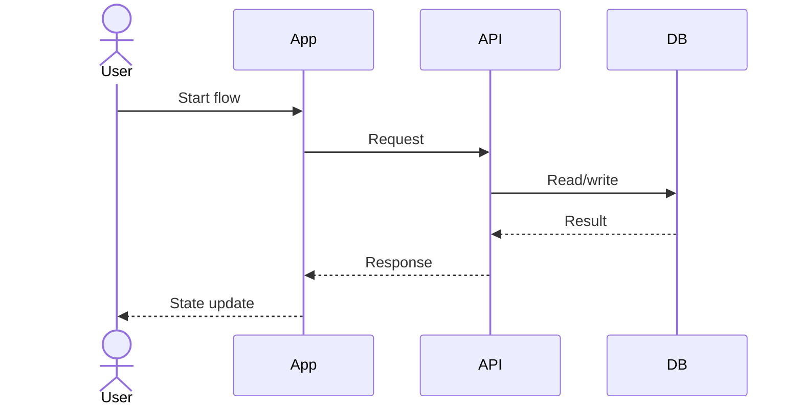
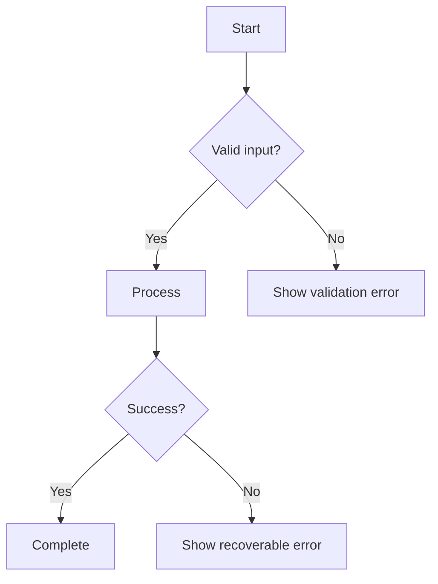
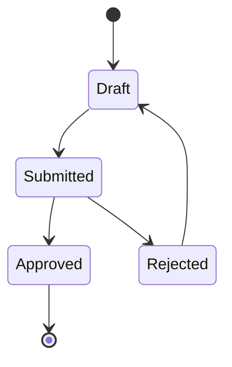

# Output Template

> **로드 시점**: 기획 문서, PRD, RFP, 요구사항, 회의록, 스토리보드, 서비스 아이디어를 구현 준비 산출물로 보강할 때

사용자는 요약이 아니라 구현 준비도를 원한다. 아래 항목은 내부 검토 기준으로만 사용하고, 최종 PPTX에는 페이지별 목적/흐름/상태/정책/구현 메모/검증/확인 필요 결과로 자연스럽게 반영한다. 근거 없는 내용은 `확인 필요`로 표시한다. 치명 정보가 없으면 먼저 1-3개만 묻는다.

최종 PPTX에 `Planning Harness 체크리스트`, `22개 검토 항목`, `Executive Summary`, `Final Document` 같은 내부 항목명을 그대로 슬라이드로 만들지 않는다.

## 페이지별 주입 규칙
- 각 슬라이드에는 해당 화면/흐름에 맞는 내부 검토 결과를 1개 이상 넣는다.
- 화면 슬라이드는 목적, 대상/권한, 진입 경로, 상태, validation, API/Data, 예외, acceptance criteria 중 관련 항목을 오른쪽 메모나 화면 하단 메모에 반영한다.
- 흐름/정책/기술 슬라이드는 user flow, business rule, security/privacy, API/DB, test/verify, risk, 확인 필요를 해당 페이지 안에 나눠 반영한다.
- 테이블명세서 슬라이드는 테이블 목적, 컬럼 명세, PK/FK/관계, 제약/인덱스, 상태값, API/validation 연결, 개인정보/권한, 확인 필요를 해당 페이지 안에 나눠 반영한다.
- 테이블명세서 마지막에는 ERD 슬라이드를 두고, 테이블 간 핵심 관계와 불확실한 관계를 구분해 표시한다.
- 내부 항목명을 그대로 나열하지 말고 `개발 지시 메모`, `정책 확인 필요`, `Verify focus`, `상태/예외`처럼 페이지 목적에 맞는 표현으로 바꾼다.

## Step 1-12 검토 체크리스트
1. Analyze: Business Goals, Functional Requirements, Non Functional Requirements, Constraints, Stakeholders, Assumptions를 뽑는다.
2. Requirement Split: Feature, Business Rule, Screen, API, Database, Validation, Exception, Permission, Notification, Logging으로 나눈다.
3. Requirement Review: 누락된 기능, 화면, API, DB, 사용자 흐름, 비즈니스 룰, 검증, 오류 처리, 빈/로딩 상태, 권한, 인증, 접근성, 반응형, 성능, 보안, 로깅, 모니터링, 분석, 알림, 관리자 기능, 테스트를 찾는다.
4. Policy Review: Business, Service, Operational, Security, Validation 정책을 검토하고 필요한 정책 초안을 만든다.
5. Logic Review: Invalid Flow, Circular Logic, Missing Branches, Duplicate Logic, Impossible States를 찾고 엣지 케이스를 만든다.
6. UX Review: 여정, 내비게이션, 빈/오류/로딩 상태, 접근성, 모바일 경험을 검토한다.
7. User Flow: 사용자, 관리자, 대안, 예외 흐름을 만든다.
8. Screen Planning: 화면 목록, 계층, 내비게이션, IA를 만든다.
9. Technical Planning: API, DB, Entity 후보와 sequence/activity/state diagram을 만든다.
10. QA Planning: 테스트 시나리오, acceptance criteria, edge cases, regression checklist를 만든다.
11. Development Planning: Epic, User Story, Task, Priority, Dependencies, Risks로 나눈다.
12. Final Review: completeness, missing items, risks, improvements, readiness를 판정한다.

## 내부 검토 항목 순서

### 1. Executive Summary
- 목적, 대상 사용자, 해결 문제, 기대 효과를 3-5문장으로 정리한다.
- 구현 준비도: Ready / Needs Clarification / Not Ready 중 하나로 표시한다.

### 2. Requirement Analysis
- Business Goals
- Stakeholders
- Constraints
- Assumptions
- 확인 필요

### 3. Functional Requirements
- 기능별로 사용자 가치, 트리거, 주요 동작, 완료 조건을 정리한다.
- 기능이 불명확하면 `확인 필요`로 분리한다.

### 4. Non Functional Requirements
- Performance, Security, Accessibility, Responsive, Reliability, Privacy, Maintainability를 점검한다.
- 수치가 없으면 임의 수치를 만들지 말고 목표 수준만 제안한다.

### 5. Business Rules
- 상태 전이, 권한, 예외, 제한, 승인, 운영 규칙을 나눈다.
- 정책인지 기능인지 섞이지 않게 쓴다.

### 6. Missing Requirements
- Missing Features
- Missing Screens
- Missing APIs
- Missing Database
- Missing User Flow
- Missing Business Rules
- Missing Validation
- Missing Error/Empty/Loading States
- Missing Permission/Auth
- Missing Analytics/Logging/Monitoring
- Missing Admin Functions
- Missing Test Cases

### 7. Missing Policies
- Business Policy
- Service Policy
- Operational Policy
- Security Policy
- Validation Policy

### 8. Edge Cases
- 잘못된 입력, 중복 요청, 권한 없음, 만료, 취소, 네트워크 실패, 동시성, 데이터 없음, 외부 연동 실패를 포함한다.

### 9. User Flow
- Normal Flow
- Alternative Flow
- Exception Flow
- Admin Flow

### 10. Screen List
- 화면별로 화면명, 목적, description, 대상 사용자/권한, 진입 경로, 주요 정보 영역, 주요 CTA, 상태, validation, 관련 API/데이터, 예외 케이스, acceptance criteria를 표나 반복 블록으로 정리한다.
- 상태는 기본, 빈 상태, 로딩, 오류, 권한 없음까지 확인한다.

### 11. Information Architecture
- 메뉴 구조, 화면 계층, 주요 정보 그룹, 탐색 규칙을 정리한다.

### 12. API Draft
- endpoint 후보, method, 목적, 요청/응답 핵심 필드, 권한, 오류를 초안으로 쓴다.
- 실제 API 이름은 확정 정보가 없으면 후보로 표시한다.

### 13. Database Draft
- entity 후보, 주요 필드, 관계, 상태값, 인덱스/제약 후보를 쓴다.
- 개인정보나 민감정보는 별도 표시한다.

### 13-1. Table Spec
- 테이블별 목적과 소유 도메인을 쓴다.
- 컬럼 표에는 컬럼명, 타입, 필수 여부, 기본값, 키, 설명을 포함한다.
- PK/FK, 관계, unique/index, nullable/default, 상태값/enum, soft delete, created/updated audit field를 점검한다.
- 개인정보/민감정보, 권한별 접근 범위, validation/API와 컬럼 불일치를 별도 표시한다.
- 마지막 ERD 슬라이드에는 주요 테이블, PK/FK 연결, 관계 방향을 요약하고, 과밀하면 도메인별로 나누거나 핵심 관계만 남긴다.
- 근거가 없거나 확정되지 않은 타입, 관계, 기본값, 인덱스, 제약조건은 `확인 필요`로 표시한다.

### 14. Sequence Diagram

### 15. Activity Diagram

### 16. State Diagram

### 17. Test Scenario
- Happy path
- Validation failure
- Permission failure
- Empty state
- Loading state
- Error recovery
- Admin path
- Regression path

### 18. Acceptance Criteria
- Given / When / Then 형식으로 기능별 완료 조건을 쓴다.
- 측정 불가능한 표현은 구체 조건으로 바꾼다.

### 19. UX Review
- 사용자가 다음 행동을 이해할 수 있는지
- 화면 전환과 피드백이 자연스러운지
- 빈/오류/로딩 상태가 충분한지
- 모바일에서 핵심 작업이 가능한지

### 20. Accessibility Review
- 키보드 접근
- 포커스 순서
- 대체 텍스트
- 명도 대비
- 오류 메시지 연결
- 스크린리더 라벨

### 21. Development Issues
- Epic
- User Story
- Task
- Priority
- Dependencies
- Risks

### 22. Final Enhanced Planning Document
- 위 내용을 통합해 구현팀이 바로 작업할 수 있는 최종 기획서로 재정리한다.
- 마지막에 `개발 착수 전 확인 필요`만 따로 모은다.
